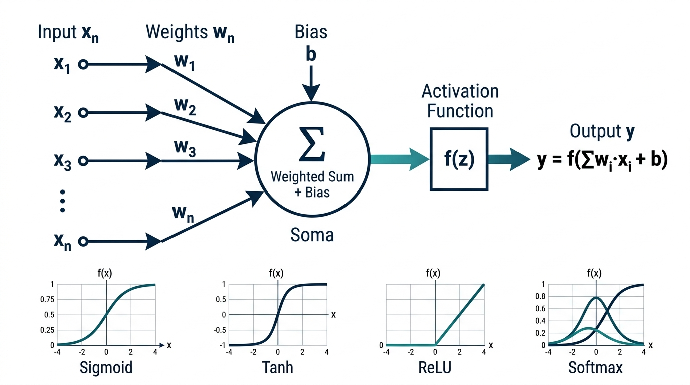
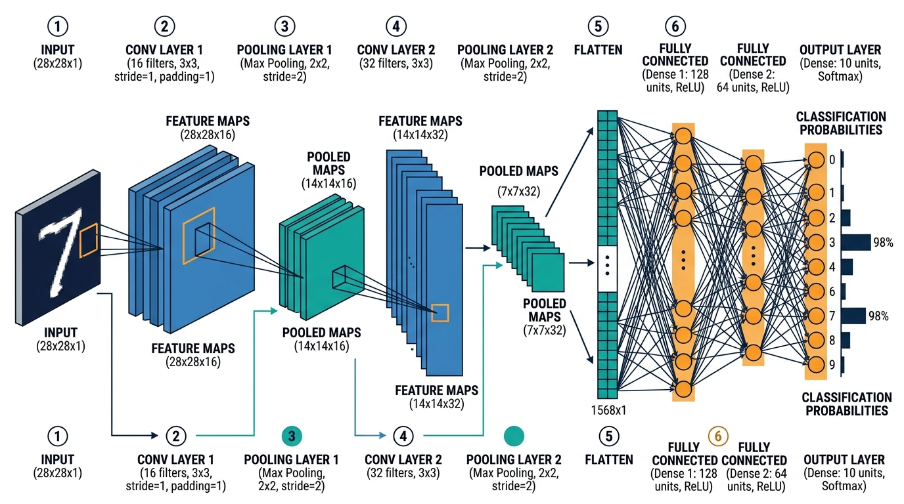
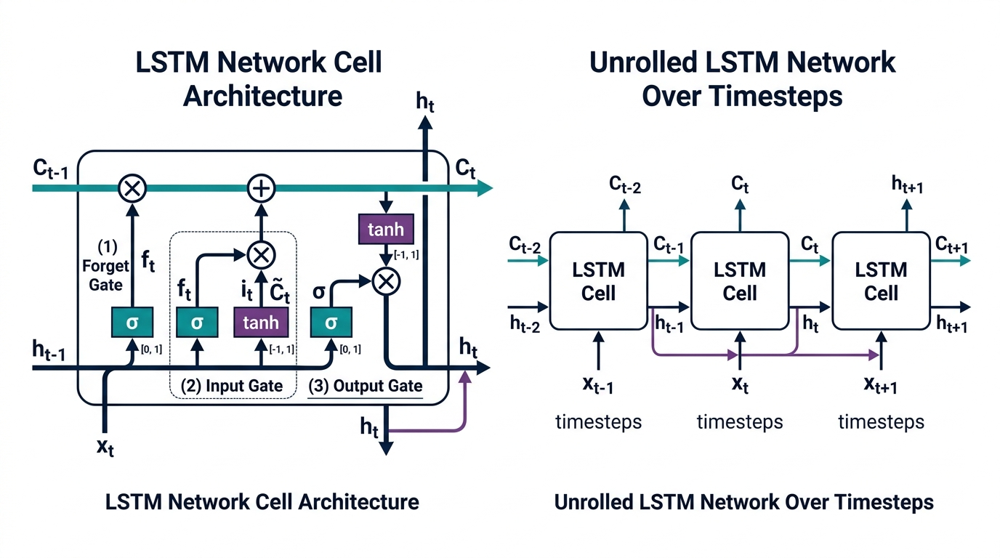
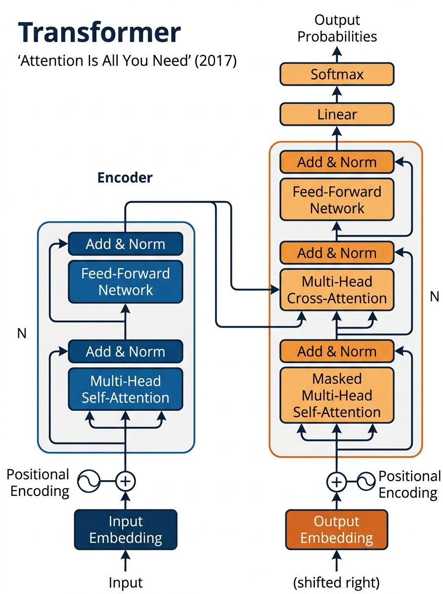
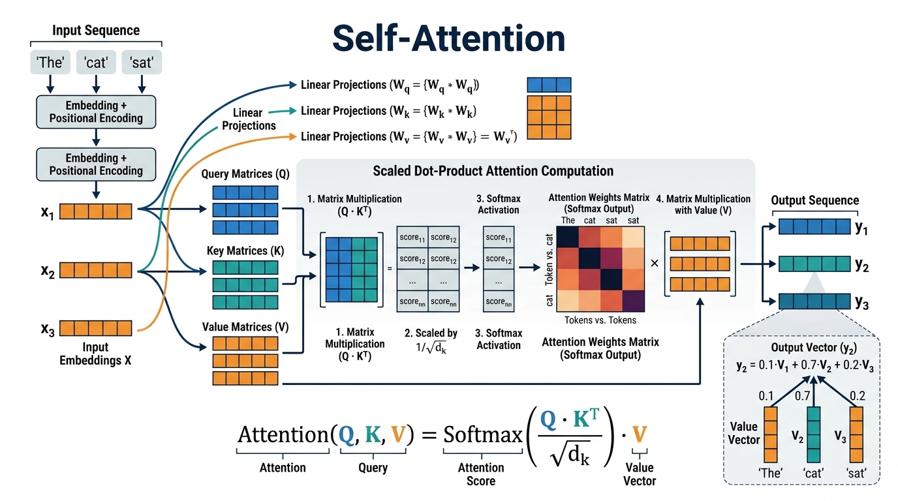

# Histórico das Redes Neurais

## 1. A Evolução dos Neurônios e Redes Neurais: Uma Linha do Tempo

A história das redes neurais artificiais é uma jornada fascinante que se estende por quase um século, marcada por avanços teóricos, longos períodos de estagnação (os chamados "invernos da IA") e ressurgimentos impulsionados por novas ideias e poder computacional.

### 1.1 Os Primórdios (1943–1969)

- **1943 — Warren McCulloch e Walter Pitts** publicaram o artigo seminal *"A Logical Calculus of the Ideas Immanent in Nervous Activity"*, propondo o primeiro modelo matemático de um neurônio artificial. O modelo McCulloch-Pitts demonstrou que redes de neurônios simples, usando lógica proposicional, poderiam, em princípio, computar qualquer função computável. Este foi o marco zero da neurocomputação.

- **1949 — Donald Hebb** publicou *"The Organization of Behavior"*, introduzindo a **regra de aprendizado de Hebb**: "Neurônios que disparam juntos, se conectam juntos". Este princípio tornou-se a base teórica para algoritmos de aprendizado em redes neurais, formalizando como as conexões sinápticas se fortalecem com o uso.

- **1957 — Frank Rosenblatt** inventou o **Perceptron**, o primeiro modelo de rede neural capaz de aprender por meio de um algoritmo de treinamento. O Perceptron era um classificador linear binário que ajustava seus pesos com base nos erros de classificação. Foi implementado em hardware dedicado (o Mark I Perceptron) e gerou enorme entusiasmo na comunidade científica.

- **1969 — Marvin Minsky e Seymour Papert** publicaram o livro *"Perceptrons"*, demonstrando matematicamente as limitações do Perceptron de camada única — em especial, sua incapacidade de resolver o problema do **XOR** (ou exclusivo). Esta publicação é frequentemente apontada como o gatilho do primeiro "inverno da IA", um período de redução drástica no financiamento e interesse por redes neurais.

### 1.2 O Renascimento (1980–1998)

- **1980 — Kunihiko Fukushima** propôs o **Neocognitron**, uma rede neural hierárquica inspirada no córtex visual, considerada a precursora direta das redes neurais convolucionais modernas. O Neocognitron introduziu conceitos de camadas convolucionais e subamostragem.

- **1986 — David Rumelhart, Geoffrey Hinton e Ronald Williams** popularizaram o algoritmo de **retropropagação (backpropagation)** para treinamento de redes neurais multicamadas, publicando o artigo *"Learning representations by back-propagating errors"* na revista *Nature*. Este algoritmo resolveu o problema do treinamento de redes profundas e é, até hoje, o pilar fundamental do aprendizado profundo.

- **1989 — Yann LeCun** aplicou com sucesso redes neurais convolucionais (CNNs) ao reconhecimento de dígitos manuscritos, desenvolvendo a arquitetura **LeNet-5**. Este trabalho demonstrou o poder prático das CNNs e foi adotado pelo serviço postal dos Estados Unidos para leitura automática de CEPs.

- **1997 — Sepp Hochreiter e Jürgen Schmidhuber** propuseram a rede **LSTM (Long Short-Term Memory)**, uma arquitetura recorrente projetada para resolver o problema do **desaparecimento do gradiente** em sequências longas. A LSTM introduziu o conceito de "portões" (gates) que controlam o fluxo de informação, permitindo que a rede memorize dependências de longo prazo.

### 1.3 A Era do Aprendizado Profundo (2006–2017)

- **2006 — Geoffrey Hinton e Ruslan Salakhutdinov** publicaram um método para treinar **redes de crenças profundas (Deep Belief Networks)** de forma eficiente, usando pré-treinamento não supervisionado camada por camada. Este trabalho é frequentemente citado como o início da revolução do aprendizado profundo (*Deep Learning*).

- **2012 — Alex Krizhevsky, Ilya Sutskever e Geoffrey Hinton** venceram o desafio **ImageNet** com a rede **AlexNet**, uma CNN profunda treinada com GPUs. A AlexNet reduziu a taxa de erro em classificação de imagens de 26% para 15,3%, uma melhoria sem precedentes que demonstrou definitivamente a superioridade das redes profundas em tarefas de visão computacional.

- **2014 — Ian Goodfellow** introduziu as **Redes Adversárias Generativas (GANs)**, um paradigma onde duas redes neurais competem entre si: um gerador que cria dados sintéticos e um discriminador que tenta distinguir dados reais de falsos. As GANs revolucionaram a geração de imagens, áudio e vídeo.

- **2014 — Dzmitry Bahdanau, Kyunghyun Cho e Yoshua Bengio** introduziram o **mecanismo de atenção** em redes neurais para tradução automática, no artigo *"Neural Machine Translation by Jointly Learning to Align and Translate"*. Este mecanismo permitiu que modelos focassem em partes relevantes da sequência de entrada ao gerar cada elemento da saída, melhorando dramaticamente a qualidade da tradução.

- **2017 — Ashish Vaswani et al. (Google Brain)** publicaram o artigo revolucionário ***"Attention Is All You Need"***, introduzindo a arquitetura **Transformer**. Esta arquitetura abandonou completamente as recorrências (RNNs/LSTMs) em favor de mecanismos de auto-atenção (*self-attention*), permitindo processamento paralelo massivo e captura eficiente de dependências de longo alcance. O Transformer é a base de praticamente todos os grandes modelos de linguagem modernos.

---

## 2. Estruturas Clássicas das Redes Neurais

### 2.1 O Neurônio Artificial e Funções de Ativação

O neurônio artificial é a unidade computacional fundamental de uma rede neural. Inspirado no neurônio biológico, ele recebe múltiplas entradas, realiza uma soma ponderada, adiciona um viés (*bias*) e aplica uma função de ativação não-linear para produzir uma saída. Uma ilustração da formulação computacional pode ser vista na Figura 1:

**Formulação matemática do neurônio:**

Dado um vetor de entradas **x** = (x₁, x₂, ..., xₙ), um vetor de pesos **w** = (w₁, w₂, ..., wₙ) e um viés *b*, a saída do neurônio é:

$$z = \sum_{i=1}^{n} w_i \cdot x_i + b$$

$$y = f(z)$$

onde *f* é a função de ativação.

**Principais funções de ativação:**

- **Sigmoid:** $\sigma(z) = \frac{1}{1 + e^{-z}}$ — Mapeia valores para o intervalo (0, 1). Historicamente muito usada, mas sofre do problema de **saturação do gradiente** em valores extremos.

- **Tanh (Tangente Hiperbólica):** $\tanh(z) = \frac{e^z - e^{-z}}{e^z + e^{-z}}$ — Mapeia valores para o intervalo (-1, 1). Centrada em zero, o que facilita a convergência. Também sofre de saturação.

- **ReLU (Rectified Linear Unit):** $f(z) = \max(0, z)$ — Simples e computacionalmente eficiente. Resolve o problema de saturação da sigmoid/tanh para valores positivos, mas pode causar "neurônios mortos" quando z < 0 permanentemente.

- **Softmax:** $\text{softmax}(z_i) = \frac{e^{z_i}}{\sum_{j} e^{z_j}}$ — Utilizada na camada de saída para classificação multiclasse, converte um vetor de valores reais em uma distribuição de probabilidades.

---

### 2.2 Redes Neurais Convolucionais (CNNs)

As Redes Neurais Convolucionais foram projetadas especificamente para processar dados com estrutura espacial, como imagens. A ideia central é usar filtros (kernels) que deslizam sobre a entrada, extraindo características locais de forma hierárquica. A arquitetura computacional de uma CNN típica é composta por camadas convolucionais, camadas de pooling e camadas totalmente conectadas, ilustrada na Figura 2.

**Componentes principais de uma CNN:**

1. **Camada de Entrada (Input Layer):** Recebe os dados brutos, como uma imagem representada como uma matriz de pixels (largura × altura × canais de cor).

2. **Camada Convolucional (Convolutional Layer):** Aplica múltiplos filtros convolucionais à entrada. Cada filtro é uma pequena matriz de pesos que é convolvida com a entrada para produzir um **mapa de características (feature map)**. A operação de convolução para um filtro *K* sobre a entrada *I* é definida como:

$$S(i, j) = (I * K)(i, j) = \sum_m \sum_n I(i+m, j+n) \cdot K(m, n)$$

Camadas iniciais detectam bordas e texturas simples; camadas mais profundas capturam padrões cada vez mais abstratos e complexos.

3. **Camada de Pooling (Subamostragem):** Reduz as dimensões espaciais dos mapas de características, diminuindo o custo computacional e conferindo invariância a pequenas translações. O **Max Pooling** seleciona o valor máximo em cada janela de pooling; o **Average Pooling** calcula a média.

4. **Camada de Achatamento (Flatten):** Transforma os mapas de características multidimensionais em um vetor unidimensional para alimentar as camadas totalmente conectadas.

5. **Camadas Totalmente Conectadas (Fully Connected / Dense):** Funcionam como um classificador tradicional, recebendo o vetor achatado e produzindo as probabilidades de classe na saída (tipicamente via Softmax).

**Marcos importantes das CNNs:**
- **LeNet-5** (1998, Yann LeCun) — Reconhecimento de dígitos.
- **AlexNet** (2012, Krizhevsky et al.) — Vencedora do ImageNet, usou GPUs.
- **VGGNet** (2014, Simonyan & Zisserman) — Redes mais profundas (16–19 camadas).
- **GoogLeNet/Inception** (2014, Szegedy et al.) — Módulos inception para eficiência.
- **ResNet** (2015, Kaiming He et al.) — Conexões residuais permitindo redes de 152+ camadas.

---

### 2.3 Redes LSTM (Long Short-Term Memory)

As redes LSTM foram projetadas para superar o problema fundamental das Redes Neurais Recorrentes (RNNs) tradicionais: o **desaparecimento do gradiente** (*vanishing gradient*), que impedia o aprendizado de dependências temporais de longo prazo.

A inovação central da LSTM é o **estado de célula** (*cell state*), uma "esteira transportadora" de informação que percorre toda a sequência, controlada por três portões (*gates*):

**1. Portão de Esquecimento (Forget Gate):** Decide quais informações do estado de célula anterior devem ser descartadas.

$$f_t = \sigma(W_f \cdot [h_{t-1}, x_t] + b_f)$$

Onde $\sigma$ é a função sigmoid, $h_{t-1}$ é a saída anterior, $x_t$ é a entrada atual, $W_f$ são os pesos e $b_f$ é o viés. A saída $f_t$ está entre 0 (esquecer completamente) e 1 (manter completamente).

**2. Portão de Entrada (Input Gate):** Decide quais novas informações serão armazenadas no estado de célula.

$$i_t = \sigma(W_i \cdot [h_{t-1}, x_t] + b_i)$$

$$\tilde{C}_t = \tanh(W_C \cdot [h_{t-1}, x_t] + b_C)$$

O estado de célula é atualizado combinando o esquecimento seletivo com a nova informação:

$$C_t = f_t \odot C_{t-1} + i_t \odot \tilde{C}_t$$

onde $\odot$ representa a multiplicação elemento a elemento (produto de Hadamard).

**3. Portão de Saída (Output Gate):** Determina qual parte do estado de célula será utilizada como saída.

$$o_t = \sigma(W_o \cdot [h_{t-1}, x_t] + b_o)$$

$$h_t = o_t \odot \tanh(C_t)$$

As LSTMs foram amplamente utilizadas em tarefas sequenciais como tradução automática, reconhecimento de fala, geração de texto e análise de séries temporais, dominando o estado da arte até serem gradualmente substituídas por arquiteturas baseadas em Transformers a partir de 2017.

---

## 3. A Arquitetura Transformer

### 3.1 Formalização do Transformer Original (2017)

Em junho de 2017, Ashish Vaswani e colegas do Google Brain e Google Research publicaram o artigo *"Attention Is All You Need"*, apresentando a arquitetura **Transformer**. Esta arquitetura representou uma ruptura paradigmática ao abandonar completamente as estruturas recorrentes e convolucionais em favor de mecanismos de **auto-atenção** (*self-attention*).

A arquitetura original do Transformer é composta por dois blocos principais: o **Encoder** (codificador) e o **Decoder** (decodificador), cada um contendo N = 6 camadas idênticas empilhadas.

**Encoder:**
Cada camada do encoder contém duas subcamadas:
1. **Multi-Head Self-Attention** — permite que cada posição da sequência atenda a todas as outras posições.
2. **Feed-Forward Network (FFN)** — uma rede totalmente conectada posicional aplicada independentemente a cada posição.

Ambas as subcamadas utilizam **conexões residuais** seguidas de **normalização de camada** (*Layer Normalization*):

$$\text{sublayer\_output} = \text{LayerNorm}(x + \text{Sublayer}(x))$$

**Decoder:**
Cada camada do decoder contém três subcamadas:
1. **Masked Multi-Head Self-Attention** — similar à auto-atenção do encoder, mas com uma máscara que impede que posições atendam a posições futuras (garantindo a propriedade auto-regressiva).
2. **Multi-Head Cross-Attention** — onde as queries vêm do decoder e as keys/values vêm da saída do encoder, permitindo que o decoder "consulte" a representação da entrada.
3. **Feed-Forward Network** — idêntica à do encoder.

**Embeddings e Codificação Posicional:**
Como o Transformer não possui recorrência, a informação sobre a posição dos tokens na sequência é injetada por meio de **codificações posicionais** (*positional encodings*), somadas aos embeddings de entrada:

$$PE_{(pos, 2i)} = \sin\left(\frac{pos}{10000^{2i/d_{model}}}\right)$$

$$PE_{(pos, 2i+1)} = \cos\left(\frac{pos}{10000^{2i/d_{model}}}\right)$$

onde *pos* é a posição do token, *i* é a dimensão, e $d_{model}$ é a dimensão do modelo (512 no artigo original).

---

## 4. O Mecanismo de Atenção em Detalhes

### 4.1 Scaled Dot-Product Attention

O mecanismo de atenção é o coração do Transformer. Ele permite que o modelo determine, para cada token da sequência, quais outros tokens são mais relevantes para a sua representação.

Para cada token de entrada, três vetores são computados por meio de projeções lineares aprendidas:

- **Query (Q):** Representa "o que este token está procurando".
- **Key (K):** Representa "o que este token oferece".
- **Value (V):** Representa "o conteúdo informacional deste token".

Esses vetores são obtidos multiplicando o embedding de entrada $x$ por matrizes de pesos aprendidas:

$$Q = x \cdot W^Q, \quad K = x \cdot W^K, \quad V = x \cdot W^V$$

A atenção é então calculada como:

$$\text{Attention}(Q, K, V) = \text{softmax}\left(\frac{Q \cdot K^T}{\sqrt{d_k}}\right) \cdot V$$

Onde:
- $Q \cdot K^T$ calcula o **produto escalar** entre todas as queries e todas as keys, produzindo uma matriz de **scores de atenção** que indica a compatibilidade entre cada par de tokens.
- $\sqrt{d_k}$ é o **fator de escala**, onde $d_k$ é a dimensão dos vetores de key. Esta divisão previne que os produtos escalares cresçam demais em magnitude, o que empurraria a softmax para regiões de gradiente extremamente pequeno.
- **softmax** normaliza os scores em pesos que somam 1, formando uma **distribuição de probabilidade** sobre os tokens de entrada.
- A multiplicação final com $V$ produz a saída: uma **combinação ponderada** dos vetores de valor, onde os pesos refletem a relevância de cada token.

### 4.2 Multi-Head Attention

Em vez de computar uma única função de atenção, o Transformer utiliza **atenção multi-cabeça** (*multi-head attention*). A ideia é projetar as queries, keys e values em *h* subespaços diferentes e computar a atenção em paralelo:

$$\text{MultiHead}(Q, K, V) = \text{Concat}(\text{head}_1, \ldots, \text{head}_h) \cdot W^O$$

$$\text{onde } \text{head}_i = \text{Attention}(Q W_i^Q, K W_i^K, V W_i^V)$$

No artigo original, $h = 8$ cabeças, com $d_k = d_v = d_{model}/h = 64$.

Isso permite que o modelo capture diferentes tipos de relações simultaneamente: uma cabeça pode aprender relações sintáticas, outra semânticas, outra de co-referência, etc.

### 4.3 Como o Token de Saída é Gerado

O processo de geração de cada token de saída no Transformer funciona da seguinte forma:

1. **Embedding + Codificação Posicional:** O token de entrada (ou a sequência de tokens já gerados, no caso do decoder) é convertido em um vetor de embedding e somado à codificação posicional.

2. **Self-Attention no Encoder:** Cada token da entrada é transformado em uma representação contextualizada que incorpora informação de toda a sequência de entrada. Os valores de "memória" do neurônio transformer são essencialmente as matrizes de pesos aprendidas ($W^Q$, $W^K$, $W^V$) e os pesos da FFN, que codificam o conhecimento adquirido durante o treinamento.

3. **Cross-Attention no Decoder:** O token sendo gerado no decoder usa sua query para consultar as keys e values produzidas pelo encoder, determinando quais partes da entrada são mais relevantes para gerar o próximo token.

4. **Feed-Forward + Projeção Linear + Softmax:** A representação final é projetada para o tamanho do vocabulário e normalizada via softmax, produzindo uma distribuição de probabilidade sobre todos os tokens possíveis.

5. **Seleção do Token:** O token com a maior probabilidade (ou um token amostrado da distribuição) é selecionado como saída.

---

## 5. Transformers e a Geração de Tokens: A Conexão com a Programação de Linguagem Natural

### 5.1 O Objetivo Central: Prever o Próximo Token

O objetivo fundamental de um modelo baseado em Transformer, quando treinado como modelo de linguagem, é **prever o próximo token** dado o contexto anterior. Formalmente, o modelo aprende a maximizar a probabilidade:

$$P(x_t | x_1, x_2, \ldots, x_{t-1})$$

Onde $x_t$ é o token na posição *t* e $x_1, \ldots, x_{t-1}$ são todos os tokens precedentes. Durante o treinamento, o modelo é exposto a enormes corpora de texto e aprende, por meio da retropropagação, a ajustar seus milhões (ou bilhões) de parâmetros para prever com precisão cada próximo token.

Na geração de texto, o processo é **auto-regressivo**: o modelo gera um token de cada vez, alimentando o token gerado de volta como entrada para gerar o próximo, até que um token de parada seja produzido ou um limite de comprimento seja atingido.

### 5.2 A Evolução da Programação de Linguagem Natural (PLN)

A trajetória da PLN até os LLMs modernos pode ser dividida em grandes eras:

**Era 1 — Abordagens Baseadas em Regras (1950s–1980s):**
- Sistemas como ELIZA (1966, Joseph Weizenbaum) e SHRDLU (1968, Terry Winograd) usavam regras gramaticais e padrões pré-definidos manualmente.
- Limitações severas: não generalizavam, eram frágeis e exigiam imenso esforço de engenharia para cada novo domínio.

**Era 2 — Abordagens Estatísticas (1990s–2010s):**
- Modelos como **n-gramas**, **Hidden Markov Models (HMMs)** e **Conditional Random Fields (CRFs)** utilizavam estatísticas de co-ocorrência de palavras extraídas de corpora.
- **Word2Vec** (2013, Tomas Mikolov, Google) e **GloVe** (2014, Stanford) introduziram **embeddings de palavras**: representações vetoriais densas que capturavam relações semânticas (ex: rei - homem + mulher ≈ rainha).
- Melhoria significativa, mas modelos ainda tinham contexto limitado e não entendiam dependências de longo alcance.

**Era 3 — Redes Neurais Recorrentes (2014–2017):**
- **RNNs** e **LSTMs** aplicadas a tradução automática (Google Neural Machine Translation, 2016), chatbots e análise de sentimentos.
- O mecanismo de atenção (Bahdanau et al., 2014) foi um divisor de águas, mas as arquiteturas recorrentes ainda eram lentas e difíceis de paralelizar.

**Era 4 — Transformers e Pré-treinamento em Larga Escala (2017–presente):**
- **BERT** (2018, Google) — Transformer bidirecional pré-treinado por meio de *Masked Language Modeling*. Revolucionou tarefas de compreensão de linguagem.
- **GPT** (2018, OpenAI) — Transformer decoder-only pré-treinado de forma auto-regressiva. Demonstrou que modelos de linguagem grandes, pré-treinados em dados não rotulados, poderiam ser ajustados (*fine-tuned*) para diversas tarefas.
- **GPT-2** (2019), **GPT-3** (2020, 175B parâmetros), **GPT-4** (2023) — Escalas crescentes demonstrando **capacidades emergentes**: habilidades que surgem apenas em modelos acima de certos tamanhos.
- **ChatGPT** (novembro de 2022) — Aplicou RLHF (*Reinforcement Learning from Human Feedback*) ao GPT-3.5, tornando modelos conversacionais acessíveis ao público em geral e desencadeando a corrida global por IA generativa.

### 5.3 O Papel do Hardware e do Big Data

A revolução dos Transformers só foi possível graças a dois fatores convergentes:

**Hardware:**
- **GPUs (Graphics Processing Units):** A partir de 2012 (AlexNet), GPUs NVIDIA (CUDA) tornaram-se o padrão para treinamento de redes neurais, oferecendo paralelismo massivo. As séries A100 e H100 da NVIDIA, com seus Tensor Cores, foram projetadas especificamente para operações de álgebra linear em redes neurais.
- **TPUs (Tensor Processing Units):** Desenvolvidas pelo Google a partir de 2016, ASICs otimizados especificamente para cargas de trabalho de aprendizado de máquina. As TPUs v5 e v6 são usadas para treinar os maiores modelos do mundo.
- **Clusters de treinamento:** Modelos como GPT-4 e Gemini requerem clusters com dezenas de milhares de GPUs/TPUs interconectados, custando centenas de milhões de dólares em computação.

**Big Data:**
- A explosão de dados textuais na internet (Wikipedia, livros, código-fonte, redes sociais, artigos científicos) forneceu corpora de treinamento com **trilhões de tokens**.
- Técnicas de curadoria de dados, filtragem de qualidade e desduplicação tornaram-se tão importantes quanto a arquitetura do modelo.
- Dados multimodais (imagens, áudio, vídeo) ampliaram as capacidades dos modelos para além do texto.

---

## 6. O que é um LLM (Large Language Model)?

Um **Large Language Model (LLM)** — Modelo de Linguagem de Grande Porte — é um modelo de rede neural, tipicamente baseado na arquitetura Transformer, treinado em enormes quantidades de dados textuais para compreender e gerar linguagem natural.

O termo "large" (grande) refere-se ao número de **parâmetros** do modelo — os pesos e vieses que são ajustados durante o treinamento. A definição do que constitui "large" evoluiu dramaticamente ao longo dos anos:

| Época | Modelo de Referência | Número de Parâmetros | Considerado "Large" |
|:------|:---------------------|:---------------------|:--------------------|
| 2018 | GPT-1 (OpenAI) | 117 milhões | Sim, na época |
| 2019 | GPT-2 (OpenAI) | 1,5 bilhão | Considerado muito grande |
| 2020 | GPT-3 (OpenAI) | 175 bilhões | Revolucionário em escala |
| 2023 | GPT-4 (OpenAI) | ~1,76 trilhão (estimado, MoE) | Fronteira |
| 2024 | DeepSeek-V3 | 671 bilhões (37B ativos) | Eficiente com MoE |
| 2026 | DeepSeek-V4 Pro | 1,6 trilhão (49B ativos) | Estado da arte atual |

**A escala de hoje:** Em meados de 2026, um computador de consumo comum (com uma GPU de 16–24 GB de VRAM) consegue executar modelos de **bilhões** de parâmetros localmente (como Llama 3.1 8B, Phi-4 14B ou Mistral 7B), graças a técnicas de **quantização** (redução de precisão de pesos de 32-bit para 4-bit ou 8-bit). Enquanto isso, os modelos de fronteira já ultrapassam a casa do **trilhão** de parâmetros, embora utilizem arquiteturas **Mixture-of-Experts (MoE)** onde apenas uma fração dos parâmetros é ativada para cada token, mantendo a eficiência computacional.

**Mixture-of-Experts (MoE):** Esta arquitetura divide a rede em múltiplos "especialistas" (sub-redes), e um mecanismo de roteamento (*gating*) seleciona apenas um subconjunto de especialistas para processar cada token. Isso permite modelos com trilhões de parâmetros totais, mas com custo de inferência equivalente a modelos muito menores.

---

## 7. Dados de Entrada e Saída nos Modelos de IA Modernos

### 7.1 Dados de Entrada (Modalidades Suportadas)

Os modelos de IA mais modernos são **multimodais**, isto é, aceitam e processam múltiplos tipos de dados simultaneamente:

- **Texto:** Linguagem natural em dezenas de idiomas, código de programação, dados estruturados (tabelas, JSON, XML).
- **Imagens:** Fotografias, diagramas, capturas de tela, documentos digitalizados, gráficos científicos.
- **Áudio:** Fala humana, música, efeitos sonoros, gravações ambientais.
- **Vídeo:** Sequências de vídeo com compreensão temporal de eventos e ações.
- **Documentos:** PDFs, planilhas, apresentações, com extração inteligente de conteúdo.
- **Dados estruturados:** Bases de dados, APIs, resultados de ferramentas e sensores.

### 7.2 Dados de Saída (Capacidades de Geração)

Os modelos mais avançados de 2025–2026 podem gerar:

- **Texto:** Respostas conversacionais, artigos, relatórios, código de programação, traduções, resumos.
- **Imagens:** Geração de imagens fotorrealistas e artísticas a partir de descrições textuais (DALL·E 3, Midjourney, Imagen 3).
- **Áudio e Fala:** Síntese de voz natural, geração de música, efeitos sonoros.
- **Vídeo:** Geração de clipes de vídeo a partir de texto (Sora da OpenAI, Veo do Google).
- **Código executável:** Escrita, depuração e refatoração de código em múltiplas linguagens.
- **Ações agênticas:** Interação com interfaces gráficas, navegação web, execução de ferramentas, gerenciamento de arquivos — os chamados "agentes de IA".

---

## 8. Principais Empresas Desenvolvedoras de Modelos de IA

### 8.1 OpenAI

**Fundação:** 2015 (São Francisco, EUA)
**Tipo:** Modelos fechados (proprietários)
**Missão:** Garantir que a Inteligência Artificial Geral (AGI) beneficie toda a humanidade.

**Histórico de Modelos Flagship:**

| Modelo | Data de Lançamento | Parâmetros | Entrada | Saída |
|:-------|:-------------------|:-----------|:--------|:------|
| GPT-1 | Junho 2018 | 117M | Texto | Texto |
| GPT-2 | Fevereiro 2019 | 1,5B | Texto | Texto |
| GPT-3 | Junho 2020 | 175B | Texto | Texto |
| DALL·E | Janeiro 2021 | 12B | Texto | Imagem |
| ChatGPT (GPT-3.5) | Novembro 2022 | ~175B | Texto | Texto |
| GPT-4 | Março 2023 | ~1,76T (estimado, MoE) | Texto, Imagem | Texto |
| GPT-4o | Maio 2024 | ~200B (estimado) | Texto, Imagem, Áudio | Texto, Áudio |
| o1 | Setembro 2024 | Não divulgado | Texto, Imagem | Texto (com raciocínio) |
| GPT-5 | Agosto 2025 | Não divulgado | Multimodal | Multimodal |
| GPT-5.6 (Sol/Terra/Luna) | Julho 2026 | Não divulgado | Multimodal | Multimodal + Agentes |

**Destaque:** A OpenAI foi a responsável por popularizar os LLMs com o lançamento do ChatGPT em 2022, que atingiu 100 milhões de usuários em dois meses. Em 2025–2026, a empresa migrou para modelos "agênticos" com capacidades de uso autônomo de computadores (GPT-5.6 Sol).

---

### 8.2 Google (DeepMind)

**Fundação:** Google DeepMind formado em 2023 pela fusão do Google Brain com a DeepMind (fundada em 2010 em Londres).
**Tipo:** Modelos fechados (Gemini) e abertos (Gemma).

**Histórico de Modelos Flagship:**

| Modelo | Data de Lançamento | Parâmetros | Entrada | Saída |
|:-------|:-------------------|:-----------|:--------|:------|
| BERT | Outubro 2018 | 340M | Texto | Embeddings/Classificação |
| T5 | Outubro 2019 | 11B | Texto | Texto |
| LaMDA | Maio 2021 | 137B | Texto | Texto |
| PaLM | Abril 2022 | 540B | Texto | Texto |
| Gemini 1.0 | Dezembro 2023 | Não divulgado | Texto, Imagem, Áudio, Vídeo | Texto |
| Gemini 1.5 Pro | Fevereiro 2024 | Não divulgado (MoE) | Multimodal (1M tokens contexto) | Texto |
| Gemma 2 (aberto) | Junho 2024 | 2B–27B | Texto | Texto |
| Gemini 2.5 Pro | Março 2025 | Não divulgado | Multimodal (1M tokens) | Texto + Raciocínio |
| Gemini 3.5 Flash | 2026 | Não divulgado | Multimodal | Multimodal + Agentes |

**Destaque:** O Google é pioneiro na pesquisa de Transformers (o artigo "Attention Is All You Need" foi escrito por pesquisadores do Google). A linha Gemini é nativamente multimodal desde sua concepção, processando texto, imagem, áudio e vídeo de forma integrada. A linha Gemma oferece modelos abertos de alta qualidade.

---

### 8.3 DeepSeek

**Fundação:** 2023 (Hangzhou, China). Subsidiária do fundo quantitativo High-Flyer.
**Tipo:** Modelos abertos (open-weight).

**Histórico de Modelos Flagship:**

| Modelo | Data de Lançamento | Parâmetros (Total / Ativos) | Entrada | Saída |
|:-------|:-------------------|:----------------------------|:--------|:------|
| DeepSeek-V2 | Maio 2024 | 236B / 21B (MoE) | Texto | Texto |
| DeepSeek-V3 | Dezembro 2024 | 671B / 37B (MoE) | Texto | Texto |
| DeepSeek-R1 | Janeiro 2025 | 671B / 37B (MoE) | Texto | Texto + Raciocínio |
| DeepSeek-V3 (0324) | Março 2025 | 671B / 37B (MoE) | Texto | Texto |
| DeepSeek-V3.1 | Agosto 2025 | Não divulgado | Texto | Texto |
| DeepSeek-V3.2 | Dezembro 2025 | Não divulgado | Texto | Texto |
| DeepSeek-V4 Pro | Abril 2026 | 1,6T / 49B (MoE) | Texto (1M contexto) | Texto |
| DeepSeek-V4 Flash | Abril 2026 | 284B / 13B (MoE) | Texto | Texto |

**Destaque:** A DeepSeek causou enorme impacto em janeiro de 2025 com o lançamento do R1, um modelo de raciocínio open-weight que rivalizou com o o1 da OpenAI em benchmarks, treinado com uma fração do custo estimado dos competidores ocidentais. Sua arquitetura MoE com Multi-head Latent Attention (MLA) tornou-se referência em eficiência. A empresa treinou o DeepSeek-V3 com um orçamento estimado de apenas ~5,6 milhões de dólares em GPUs H800, demonstrando que eficiência algorítmica pode compensar restrições de hardware.

---

### 8.4 Anthropic

**Fundação:** 2021 (São Francisco, EUA). Fundada por ex-funcionários da OpenAI, incluindo Dario e Daniela Amodei.
**Tipo:** Modelos fechados (proprietários).
**Missão:** Desenvolver IA segura e alinhada com valores humanos.

**Histórico de Modelos Flagship:**

| Modelo | Data de Lançamento | Parâmetros | Entrada | Saída |
|:-------|:-------------------|:-----------|:--------|:------|
| Claude 1 | Março 2023 | Não divulgado | Texto | Texto |
| Claude 2 | Julho 2023 | Não divulgado | Texto (100K contexto) | Texto |
| Claude 3 Opus/Sonnet/Haiku | Março 2024 | Não divulgado | Texto, Imagem | Texto |
| Claude 3.5 Sonnet | Junho 2024 | Não divulgado | Texto, Imagem | Texto |
| Claude Opus 4 / Sonnet 4 | Maio 2025 | Não divulgado | Multimodal | Texto + Agentes |
| Claude Opus 4.8 | Maio 2026 | Não divulgado | Multimodal | Texto + Pensamento Adaptativo |
| Claude Sonnet 5 | Junho 2026 | Não divulgado | Multimodal | Texto + Agentes |
| Claude Fable 5 | Junho 2026 | Não divulgado | Multimodal | Texto + Agentes Longos |

**Destaque:** A Anthropic diferencia-se pelo foco em segurança de IA, introduzindo conceitos como a "Constituição de IA" (*Constitutional AI*) para alinhar modelos. O Claude é reconhecido por suas capacidades de raciocínio complexo, honestidade e seguimento de instruções longas. A partir de 2025, a empresa introduziu o "Pensamento Adaptativo" (*Adaptive Thinking*), que ajusta dinamicamente o esforço de raciocínio conforme a complexidade da tarefa.

---

### 8.5 Mistral AI

**Fundação:** 2023 (Paris, França). Fundada por ex-pesquisadores da Google DeepMind e Meta.
**Tipo:** Modelos abertos e fechados (híbrido).

**Histórico de Modelos Flagship:**

| Modelo | Data de Lançamento | Parâmetros | Entrada | Saída |
|:-------|:-------------------|:-----------|:--------|:------|
| Mistral 7B | Setembro 2023 | 7B | Texto | Texto |
| Mixtral 8x7B | Dezembro 2023 | 46,7B / 12,9B (MoE) | Texto | Texto |
| Mistral Large (1.0) | Fevereiro 2024 | Não divulgado | Texto | Texto |
| Mistral Large 2 | Julho 2024 | 123B | Texto, Imagem | Texto |
| Mistral Large 3 | Dezembro 2025 | 675B / 41B (MoE) | Texto, Imagem (262K contexto) | Texto |
| Mistral Medium 3.5 | Abril 2026 | Não divulgado (MoE) | Multimodal | Texto + Agentes |
| Mistral Small 4 | Março 2026 | Não divulgado (MoE) | Texto | Texto + Raciocínio |

**Destaque:** A Mistral AI tornou-se a principal empresa europeia de IA, destacando-se pela filosofia de modelos abertos de alta performance. O Mistral 7B (2023) demonstrou que modelos menores, bem treinados, poderiam rivalizar com modelos muitas vezes maiores. A empresa utiliza amplamente a arquitetura Mixture-of-Experts e licenças Apache 2.0, fomentando um ecossistema aberto.

---

### 8.6 xAI (SpaceXAI)

**Fundação:** 2023 (EUA). Fundada por Elon Musk. Em 2026, passou por reestruturação e rebranding para SpaceXAI.
**Tipo:** Modelos fechados.

**Histórico de Modelos Flagship:**

| Modelo | Data de Lançamento | Parâmetros | Entrada | Saída |
|:-------|:-------------------|:-----------|:--------|:------|
| Grok 1 | Novembro 2023 | 314B (MoE) | Texto | Texto |
| Grok 1.5 | Março 2024 | Não divulgado | Texto, Imagem | Texto |
| Grok 2 | Agosto 2024 | Não divulgado | Texto, Imagem | Texto |
| Grok 3 | Fevereiro 2025 | ~2,7T (estimado) | Texto, Imagem | Texto + Raciocínio |
| Grok 4 | Julho 2025 | Não divulgado | Multimodal | Multimodal |
| Grok 4.5 | Julho 2026 | Não divulgado (MoE) | Multimodal | Multimodal + Agentes |

**Destaque:** A xAI diferencia-se pelo acesso em tempo real a dados da plataforma X (antigo Twitter) e pelo investimento massivo em infraestrutura computacional (o cluster "Colossus" com mais de 100 mil GPUs H100). O Grok 3 foi reportado como um dos maiores modelos já treinados, com estimativas de ~2,7 trilhões de parâmetros.

---

### 8.7 IBM

**Fundação:** 1911 (Nova York, EUA). Pioneira histórica em IA (Deep Blue, Watson).
**Tipo:** Modelos abertos (Apache 2.0).

**Histórico de Modelos Flagship:**

| Modelo | Data de Lançamento | Parâmetros | Entrada | Saída |
|:-------|:-------------------|:-----------|:--------|:------|
| Watson NLU | 2017 | Não divulgado | Texto | Análise de linguagem |
| Granite 3.0 | Outubro 2024 | 1B–34B (denso) | Texto | Texto |
| Granite 4.0 | 2025 | 3B–30B (híbrido Mamba-2) | Texto | Texto |
| Granite 4.1 | Abril 2026 | 3B–30B (denso) | Texto, Imagem, Áudio (512K contexto) | Texto, Embeddings, Transcrição |

**Destaque:** A IBM adota uma abordagem focada em **IA empresarial**, com modelos menores, transparentes e de código aberto. A família Granite é projetada para ser implantada em ambientes corporativos com requisitos de governança e conformidade. A arquitetura híbrida Mamba-2/Transformer do Granite 4.0 representou uma inovação significativa em eficiência de inferência e memória. Todos os modelos Granite são licenciados sob Apache 2.0.

---

### 8.8 Microsoft

**Fundação:** 1975 (Redmond, EUA). Principal investidora da OpenAI e distribuidora de modelos via Azure.
**Tipo:** Modelos abertos (Phi) e integração de modelos de terceiros (GPT via Azure).

**Histórico de Modelos Flagship (família Phi):**

| Modelo | Data de Lançamento | Parâmetros | Entrada | Saída |
|:-------|:-------------------|:-----------|:--------|:------|
| Phi-1 | Junho 2023 | 1,3B | Texto (código) | Texto |
| Phi-2 | Dezembro 2023 | 2,7B | Texto | Texto |
| Phi-3 mini | Abril 2024 | 3,8B | Texto | Texto |
| Phi-3 Vision | Maio 2024 | 4,2B | Texto, Imagem | Texto |
| Phi-4 | Dezembro 2024 | 14B | Texto | Texto (raciocínio avançado) |
| Phi-4 mini | Fevereiro 2025 | 3,8B | Texto | Texto |
| Phi-4 multimodal | Fevereiro 2025 | 5,6B | Texto, Imagem, Áudio, Vídeo | Texto |
| Phi-4-Reasoning-Vision | Março 2026 | 15B | Texto, Imagem | Texto (think/no-think) |

**Destaque:** A Microsoft lidera o segmento de **Small Language Models (SLMs)**, demonstrando que modelos com poucos bilhões de parâmetros, treinados com dados sintéticos de alta qualidade, podem rivalizar com modelos muito maiores em tarefas específicas. A família Phi é otimizada para execução local em PCs e dispositivos móveis (Copilot+ PCs). Além da família Phi, a Microsoft distribui modelos de terceiros (OpenAI, Meta, Mistral) por meio da plataforma Azure AI, tornando-se um dos maiores ecossistemas de IA do mundo.

---

## Referências Bibliográficas

1. McCulloch, W. S., & Pitts, W. (1943). A logical calculus of the ideas immanent in nervous activity. *Bulletin of Mathematical Biophysics*, 5(4), 115–133.
2. Hebb, D. O. (1949). *The Organization of Behavior*. Wiley.
3. Rosenblatt, F. (1958). The perceptron: A probabilistic model for information storage and organization in the brain. *Psychological Review*, 65(6), 386–408.
4. Minsky, M., & Papert, S. (1969). *Perceptrons: An Introduction to Computational Geometry*. MIT Press.
5. Rumelhart, D. E., Hinton, G. E., & Williams, R. J. (1986). Learning representations by back-propagating errors. *Nature*, 323(6088), 533–536.
6. LeCun, Y., Boser, B., et al. (1989). Backpropagation applied to handwritten zip code recognition. *Neural Computation*, 1(4), 541–551.
7. Hochreiter, S., & Schmidhuber, J. (1997). Long short-term memory. *Neural Computation*, 9(8), 1735–1780.
8. Hinton, G. E., & Salakhutdinov, R. R. (2006). Reducing the dimensionality of data with neural networks. *Science*, 313(5786), 504–507.
9. Krizhevsky, A., Sutskever, I., & Hinton, G. E. (2012). ImageNet classification with deep convolutional neural networks. *Advances in Neural Information Processing Systems*, 25.
10. Goodfellow, I. J., et al. (2014). Generative adversarial nets. *Advances in Neural Information Processing Systems*, 27.
11. Bahdanau, D., Cho, K., & Bengio, Y. (2014). Neural machine translation by jointly learning to align and translate. *arXiv preprint arXiv:1409.0473*.
12. Vaswani, A., et al. (2017). Attention is all you need. *Advances in Neural Information Processing Systems*, 30.
13. Devlin, J., et al. (2018). BERT: Pre-training of deep bidirectional transformers for language understanding. *arXiv preprint arXiv:1810.04805*.
14. Brown, T. B., et al. (2020). Language models are few-shot learners. *Advances in Neural Information Processing Systems*, 33.
