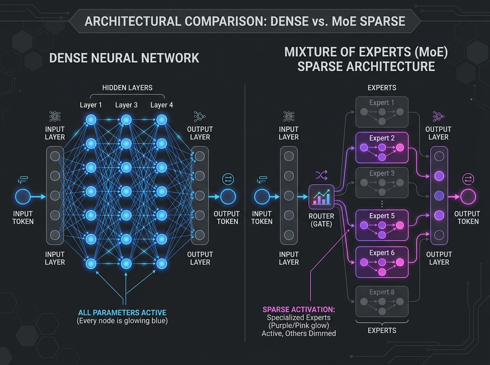
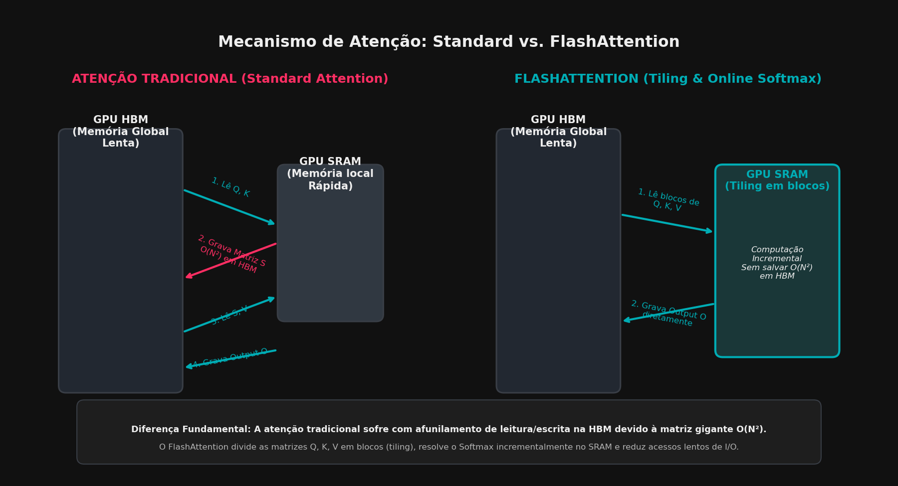
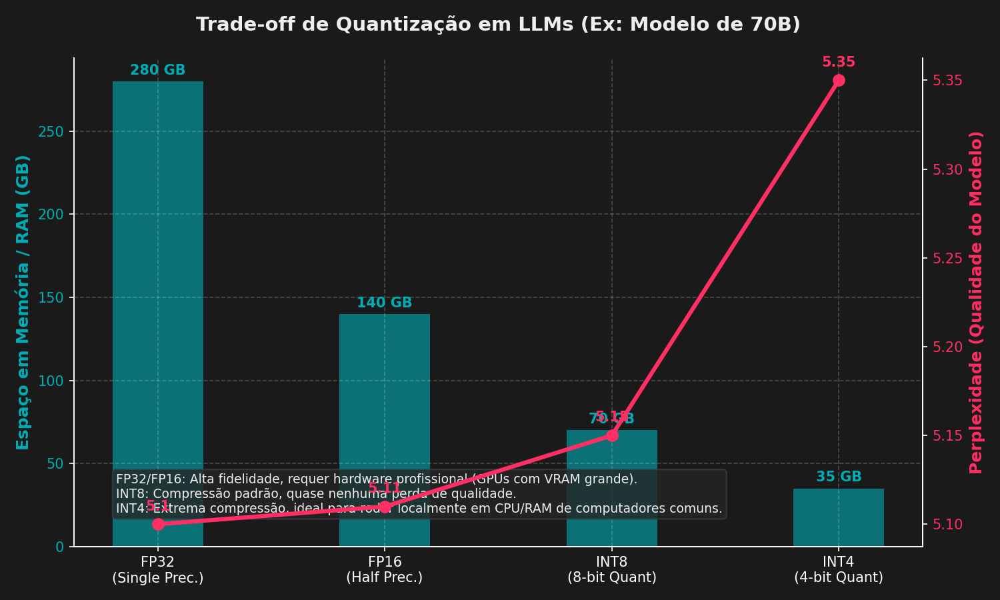

# Características e Features de Modelos de Inteligência Artificial

Este documento apresenta uma análise aprofundada sobre a arquitetura, o funcionamento, o treinamento e a otimização dos modelos de Inteligência Artificial modernos, com foco em Grandes Modelos de Linguagem (LLMs) e Modelos de Visão-Linguagem (VLMs).

---

## 1. O que são LLMs, VLMs e Classificações de Modelos de IA

### Grandes Modelos de Linguagem (LLMs)
Os **LLMs (Large Language Models)** são redes neurais profundas baseadas na arquitetura *Transformer* projetadas para processar, compreender e gerar texto em linguagem natural. Eles funcionam de maneira autorregressiva, prevendo o próximo token (subpalavra) com base no histórico de tokens anteriores. A base matemática para isso é o mecanismo de autoatenção (*Self-Attention*), que permite ao modelo capturar relações de longo alcance entre as palavras em um texto.
*   *Exemplos:* GPT-4 (OpenAI), Llama 3 e Llama 3.1 (Meta), Claude 3.5 Sonnet (Anthropic), Qwen 2.5 (Alibaba), Gemini 1.5 Pro (Google).

### Modelos de Visão-Linguagem (VLMs)
Os **VLMs (Vision-Language Models)** são extensões multimodais dos LLMs capazes de processar imagens (e em alguns casos, vídeos) conjuntamente com texto. Eles geralmente combinam um codificador visual (como um *Vision Transformer* - ViT ou uma Rede Convolucional) que traduz pixels em embeddings visuais, acoplado a um projetor que mapeia esses embeddings para o mesmo espaço de representação dos tokens de texto do LLM.
*   *Exemplos:* GPT-4o, Claude 3.5 Sonnet, Gemini 1.5 Flash, Llama 3.2 Vision.

### Outras Classificações de Modelos
*   **Modelos de Áudio/Voz (Audio/Speech Models):** Processam ondas de áudio diretamente para gerar texto (como o Whisper) ou sintetizam voz com alta expressividade a partir de texto (como o Kokoro e o ElevenLabs).
*   **Modelos de Difusão (Diffusion Models):** Modelos generativos focados na criação de imagens e mídias visuais a partir de descrições textuais (ex: Stable Diffusion, Flux, Imagen, Midjourney).
*   **Modelos de Vídeo (Video Generation Models):** Geram vídeos realistas a partir de descrições de texto ou imagens (ex: Sora, Kling, Veo, Runway Gen-3).
*   **Modelos de Embeddings (Embedding Models):** Projetados especificamente para transformar textos de tamanho variável em vetores densos de números reais que representam seu significado semântico, muito utilizados em sistemas de busca e RAG (Retrieval-Augmented Generation).

### O que os designa como "Large" e a Evolução Histórica
O termo **"Large"** (Grande) é relativo e tem mudado drasticamente com a evolução rápida do estado da arte:
*   **2018 (Era BERT):** O modelo BERT-Large, com **340 milhões de parâmetros**, era considerado um gigante que exigia recursos computacionais complexos.
*   **2019 (Era GPT-2):** O GPT-2 contava com **1,5 bilhão de parâmetros**, definindo um novo patamar para modelos massivos.
*   **2020 (Era GPT-3):** A OpenAI lançou o GPT-3 com **175 bilhões de parâmetros**, consolidando a ideia de que o aumento de escala (*scaling laws*) gera habilidades emergentes (raciocínio, aprendizado em contexto).
*   **Atualmente (2024-2026):** O conceito de tamanho se fragmentou:
    *   **Pequenos (SLMs - Small Language Models):** Modelos entre **1B e 9B** de parâmetros (ex: Llama 3 8B, Gemma 2 9B) focados em rodar localmente e com baixo custo.
    *   **Médios:** Modelos entre **10B e 90B** de parâmetros (ex: Llama 3 70B, Qwen 2.5 72B), que oferecem um excelente equilíbrio entre desempenho e viabilidade operacional.
    *   **Grandes (LLMs de Fronteira):** Modelos com mais de **100 bilhões a trilhões de parâmetros** (ex: Llama 3 405B, Mixtral 8x22B e GPT-4).

---

## 2. Modelos Densos, Esparsos e Mixture of Experts (MoE)

### Modelos Densos
Em um **modelo denso**, cada token de entrada passa por absolutamente todos os parâmetros da rede neural durante as etapas de inferência e treinamento. Embora ofereça alta qualidade por parâmetro, o custo computacional escala diretamente com o tamanho total do modelo.
*   *Exemplos:* Llama 3 8B e 70B.

### Modelos Esparsos e Mixture of Experts (MoE)
A arquitetura **MoE (Mixture of Experts)** introduz a esparsidade ao dividir certas camadas do modelo (geralmente as camadas Feed-Forward - FFN) em sub-redes independentes chamadas **"experts"** (especialistas). 
Um mecanismo chamado **Gating Network** (ou Roteador) analisa cada token de entrada e decide, dinamicamente, para quais especialistas (normalmente os 1 ou 2 melhores, chamados *Top-K*) aquele token deve ser enviado. Isso permite que um modelo tenha um número total de parâmetros muito grande (parâmetros totais), mas ative apenas uma fração deles para cada token processado (parâmetros ativos).
*   *Exemplos:* Mixtral 8x7B (possui 47 bilhões de parâmetros totais, mas ativa apenas 13 bilhões por token).
*   A principal vantagem é que o custo computacional (FLOPs) e a latência de inferência são equivalentes aos dos parâmetros ativos, enquanto a capacidade e o conhecimento do modelo são comparáveis aos de um modelo do tamanho de seus parâmetros totais.

### Tokens de Entrada e Saída na Realidade Atual
Um **token** é a unidade básica de processamento dos modelos de IA, equivalente a aproximadamente 3/4 de uma palavra em inglês (cerca de 4 caracteres).
*   **Janelas de Contexto de Entrada (Input Context):** Atualmente, as janelas de contexto alcançaram proporções massivas. Enquanto modelos antigos limitavam-se a 2.048 ou 4.096 tokens, hoje temos janelas padrões de **128.000 tokens** (Llama 3), **200.000 tokens** (Claude 3.5) e até **2.000.000 de tokens** no Gemini 1.5 Pro, permitindo o carregamento de livros inteiros, repositórios de código e horas de vídeo.
*   **Limites de Tokens de Saída (Output Context):** Embora a entrada seja muito longa, a geração de saída costuma ser menor devido a limites computacionais e de estabilidade de atenção. A maioria dos modelos atuais suporta saídas entre **4.096 e 8.192 tokens**, com modelos de fronteira expandindo para até **16.384 tokens** gerados por vez.

Abaixo, a Figura 1 ilustra a diferença estrutural no fluxo de processamento de tokens entre modelos densos e esparsos baseados em MoE.


*Figura 1: Comparação entre Arquiteturas Densas e Esparsas do Tipo Mixture of Experts (MoE)*

---

## 3. Treinamento de Modelos de IA

O ciclo de desenvolvimento e treinamento de um LLM moderno compreende três fases principais:

1.  **Pré-treinamento (Pre-training):** É a etapa mais cara e demorada. O modelo é exposto a petabytes de dados textuais não estruturados da internet. O objetivo é a previsão auto-supervisionada do próximo token. O modelo aprende gramática, fatos do mundo, lógica básica e a estrutura da linguagem.
2.  **Ajuste Fino Supervisionado (Supervised Fine-Tuning - SFT):** O modelo pré-treinado é um mero completador de texto. No SFT, ele é treinado em conjuntos de dados curados contendo pares de instruções e respostas esperadas (ex: "Pergunta: [x] -> Resposta: [y]"), aprendendo a se comportar como um assistente útil e a seguir formatos específicos (como Markdown ou JSON).
3.  **Alinhamento (Alignment - RLHF / RLAIF / DPO):** Utiliza-se Aprendizado por Reforço com Feedback Humano (RLHF) ou Feedback de IA (RLAIF) para ajustar as respostas do modelo às preferências de utilidade, veracidade e segurança. Técnicas mais recentes como *Direct Preference Optimization* (DPO) simplificam esse processo eliminando a necessidade de treinar um modelo de recompensa separado.

### Exemplo Prático Aplicado à Engenharia Elétrica
Considere o treinamento de um LLM especializado em sistemas elétricos de potência.
*   **Dado de Entrada no Pré-treinamento:**
    ```text
    "A análise de gases dissolvidos (DGA) em óleo isolante de transformadores de potência é
    regulada pela norma ABNT NBR 7274. A presença de níveis elevados de acetileno (C2H2)
    associa-se à ocorrência de arcos elétricos de alta energia sob condições de falha térmica
    ou dielétrica severa."
    ```
Durante o pré-treinamento, o modelo aprende a probabilidade estatística de palavras como "acetileno" estarem associadas a "óleo isolante", "transformadores", "ABNT NBR 7274" e "arcos elétricos". Se o engenheiro digitar "Em um transformador com alta concentração de acetileno no óleo, o diagnóstico mais provável é...", o modelo aplicará os pesos treinados para prever os tokens subsequentes: "...a ocorrência de descargas elétricas ou arcos internos de alta energia."

---

## 4. Compressão de Contexto e Quantização de Modelos

### Compressão de Contexto e FlashAttention

Com o aumento dramático das janelas de contexto (que chegam a milhões de tokens), o custo computacional e de memória da atenção tradicional torna-se o principal gargalo dos Transformers. Na autoatenção padrão, a computação das matrizes de atenção requer o cálculo de:

$$S = \text{Softmax}\left(\frac{Q K^T}{\sqrt{d_k}}\right) V$$

Para uma sequência de tamanho $N$, a matriz intermediária de atenção $S$ possui tamanho $N \times N$. Se $N = 100.000$ tokens, essa matriz ocupa cerca de **20 GB de memória** em meia precisão (FP16) por camada de atenção, inviabilizando o processamento direto na memória física da GPU.

#### O Gargalo de Memória da GPU: HBM vs. SRAM
As GPUs modernas possuem dois tipos principais de memória:
*   **HBM (High Bandwidth Memory):** É a memória global da GPU (ex: 80 GB em uma HBM2e/HBM3 de uma GPU A100). Ela possui alta capacidade, mas sua velocidade de transferência de dados (largura de banda) é lenta em relação ao poder de computação da GPU.
*   **SRAM:** É uma memória em chip extremamente rápida, mas com capacidade muito reduzida (cerca de 20 MB por GPU).

A atenção tradicional é **limitada pela memória (Memory-Bound)**. O processador da GPU gasta mais tempo lendo e gravando a matriz gigante $N \times N$ de atenção na HBM do que realizando os cálculos de multiplicação de fato.

#### Como o FlashAttention Resolve o Gargalo
Desenvolvido por Tri Dao et al., o **FlashAttention** é um algoritmo de cálculo exato da atenção que não materializa a matriz $N \times N$ na memória HBM lenta, reduzindo a complexidade de memória de $O(N^2)$ para $O(N)$. Ele funciona através de três pilares:

1.  **Tiling (Particionamento em Blocos):** As matrizes $Q$, $K$ e $V$ são divididas em pequenos blocos que cabem inteiramente na memória SRAM rápida da GPU. A atenção é calculada bloco a bloco.
2.  **Online Softmax (Softmax Incremental):** Tradicionalmente, o cálculo do Softmax requer a soma de todas as exponenciais dos elementos de uma linha antes de realizar a divisão. Para fazer isso em blocos sem ler a linha inteira, o FlashAttention calcula o Softmax incrementalmente. Ele mantém estatísticas auxiliares (o valor máximo corrente $m$ e a soma corrente $l$) para reescalar e atualizar a saída parcial à medida que novos blocos são processados.
3.  **Recomputação no Backward Pass:** Para realizar o backpropagation durante o treinamento, o algoritmo tradicional precisa salvar a matriz $N \times N$ calculada no forward pass. O FlashAttention não salva essa matriz; em vez disso, ele recomputa os valores necessários no backward pass a partir dos blocos salvos de $Q$, $K$, $V$ e do output final, o que é mais rápido do que ler a matriz de atenção da HBM.

Abaixo, a Figura 2 esquematiza a diferença de acessos à memória física da GPU entre os dois métodos.


*Figura 2: Fluxo de Acesso à Memória GPU - Atenção Tradicional vs. FlashAttention*

#### Outras Técnicas de Compressão de Contexto
*   **Activation Beacons:** Condensam as representações de ativação de múltiplos tokens passados em representações resumidas de tamanho fixo ("faróis"). Isso permite compactar sequências gigantescas na memória RAM, mantendo a capacidade de recuperação de longo prazo.
*   **Atenção de Janela Deslizante (Sliding Window Attention):** Cada token só calcula a atenção para os $W$ tokens mais próximos. Reduz a complexidade de tempo de quadrática para linear $O(N \times W)$.
*   **Interpolação de RoPE (Rotary Position Embeddings):** Técnica matemática que reescala os embeddings de posição rotatória para que um modelo treinado em um tamanho de contexto curto consiga generalizar para contextos mais longos mantendo a coesão posicional.

---

### Quantização de Modelos
Durante o treinamento, os pesos do modelo são geralmente calculados em alta precisão, como **FP32** (ponto flutuante de 32 bits, exigindo 4 bytes por parâmetro) ou **FP16/BF16** (16 bits, exigindo 2 bytes por parâmetro).

A quantização é a técnica de converter esses pesos para formatos de menor precisão, como inteiros de 8 bits (**INT8**) ou 4 bits (**INT4**), através do mapeamento linear dos valores numéricos.
A fórmula básica para converter um peso contínuo $W$ em um valor quantizado $W_q$ usando um fator de escala $S$ e um ponto zero $Z$ é:

$$W_q = \text{round}\left(\frac{W}{S}\right) + Z$$

#### Tipos de Quantização Conhecidos
*   **Quantização Pós-Treinamento (PTQ - Post-Training Quantization):** Aplica-se a quantização diretamente no modelo final já treinado. Formatos comuns incluem:
    *   **GGUF (antigo GGML):** Formato otimizado para CPU e execução local usando a biblioteca `llama.cpp`. Permite o particionamento do modelo entre a RAM do sistema e a VRAM da GPU.
    *   **GPTQ / AWQ / EXL2:** Formatos altamente otimizados para inferência rápida e eficiente em placas de vídeo (GPUs), com técnicas que protegem pesos importantes contra perda excessiva de precisão.
*   **Treinamento Ciente de Quantização (QAT - Quantization-Aware Training):** O modelo é treinado ou ajustado simulando os efeitos da quantização, resultando em menor perda de precisão final.

#### Impacto no Hardware e Viabilização Comercial
O tamanho em disco/RAM de um modelo é dado pela fórmula:

$$\text{Tamanho (em GB)} = \frac{\text{Número de Parâmetros (em bilhões)} \times \text{Bits por Parâmetro}}{8}$$

*   **Llama 3 70B em FP16 (não quantizado):** Requer $\frac{70 \times 16}{8} = 140\text{ GB}$ de VRAM. Exige o uso de servidores corporativos com múltiplas GPUs profissionais (ex: 2x A100 de 80GB).
*   **Llama 3 70B quantizado em INT4 (GGUF Q4_K_M):** Ocupa cerca de **38 GB** a **40 GB** de memória RAM. Isso viabiliza a execução do modelo em computadores comuns de desktop (com 64GB de RAM) utilizando processamento em CPU ou compartilhando com GPUs de consumo (como uma RTX 4090).

Abaixo, a Figura 3 apresenta visualmente o compromisso entre os formatos de precisão, a redução da memória necessária e o efeito na qualidade do modelo.


*Figura 3: Relação entre o nível de quantização, a demanda de memória e a variação da perplexidade/qualidade (Perplexidade medida em escala relativa - quanto menor, melhor)*

---

## 5. Principais Benchmarks Atuais

Para avaliar o desempenho e mitigar a subjetividade, os modelos de IA são testados em diversos conjuntos de dados padronizados (benchmarks):

| Categoria | Nome do Benchmark | Descrição |
| :--- | :--- | :--- |
| **Código** | **HumanEval** | Avalia a capacidade de gerar código Python correto a partir de docstrings. Mede o percentual de testes unitários que passam. |
| **Código** | **MBPP** | *Mostly Basic Python Problems*, avalia tarefas de programação e lógica em nível básico/intermediário. |
| **Matemática** | **GSM8K** | Problemas matemáticos de nível escolar de 1º e 2º grau que exigem raciocínio passo a passo (*Chain of Thought*). |
| **Matemática** | **MATH** | Problemas de matemática avançada de nível de olimpíadas escolares e competições acadêmicas. |
| **Conhecimento Geral** | **MMLU / MMLU-Pro** | *Massive Multitask Language Understanding*. Abrange dezenas de disciplinas (humanidades, ciências, direito) com perguntas de múltipla escolha. |
| **Raciocínio Avançado**| **GPQA** | Questões de nível de pós-graduação em física, química e biologia, desenhadas para serem difíceis mesmo para especialistas humanos. |
| **Preferência Humana** | **LMSYS Chatbot Arena**| Plataforma de teste cego onde usuários conversam com dois modelos anônimos e votam no melhor. Gera um ranking dinâmico baseado em Elo. |
| **Multimodalidade** | **MMMU / MathVista** | Avalia a integração de visão e texto em problemas acadêmicos, interpretação de gráficos complexos, diagramas e fórmulas visuais. |

---

## 6. Táticas para Melhoria de Eficiência

Para acelerar a inferência e reduzir os custos de servidores, a indústria desenvolveu várias otimizações de arquitetura e sistema:

### KV Caching (Cache de Chaves e Valores)
Durante a inferência autorregressiva, o modelo gera um token de cada vez. Sem o KV Cache, para prever o token $N+1$, o modelo precisaria reprocessar e recalcular as matrizes de Atenção de todos os $N$ tokens anteriores. O **KV Cache** salva as matrizes de chave ($K$) e valor ($V$) calculadas anteriormente na memória, permitindo que a rede processe apenas o novo token a cada passo de geração. Isso reduz a complexidade computacional por token gerado de $O(L^2)$ para $O(L)$, onde $L$ é o comprimento da sequência.

### Mecanismos de Atenção Otimizados
*   **MQA (Multi-Query Attention):** Usa múltiplas cabeças para a projeção de Query ($Q$), mas apenas uma única cabeça compartilhada para Key ($K$) e Value ($V$). Reduz dramaticamente a banda de memória necessária para ler o KV Cache.
*   **GQA (Grouped-Query Attention):** Uma abordagem intermediária e amplamente adotada (ex: Llama 3). Divide as cabeças de query em grupos, e cada grupo compartilha uma única cabeça de Key e Value. Oferece quase o mesmo desempenho do MQA, mas mantendo a qualidade de atenção do mecanismo original (*Multi-Head Attention*).

### Previsão de Múltiplos Tokens (Multi-Token Prediction - MTP)
Tradicionalmente, os modelos são treinados para prever apenas o próximo token único. As arquiteturas com **MTP** treinam subcabeças adicionais do Transformer para prever múltiplos tokens subsequentes em paralelo (ex: prever os tokens $N+1$, $N+2$ e $N+3$ de uma vez). Isso acelera a inferência e melhora a coerência lógica e a velocidade de codificação.

### Decodificação Especulativa (Speculative Decoding)
Uma técnica que acelera a inferência utilizando dois modelos em conjunto: um modelo pequeno e rápido (rascunhador/draft model) e um modelo grande (validador/target model). O modelo menor gera rapidamente uma sequência de tokens candidatos (ex: 5 tokens), e o modelo maior valida todos em uma única passada de processamento paralela. Se o validador concordar com os tokens gerados, todos são aceitos imediatamente, reduzindo a latência total do processo.
