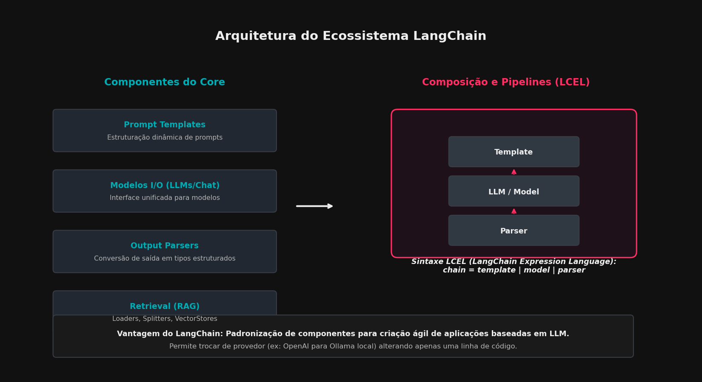
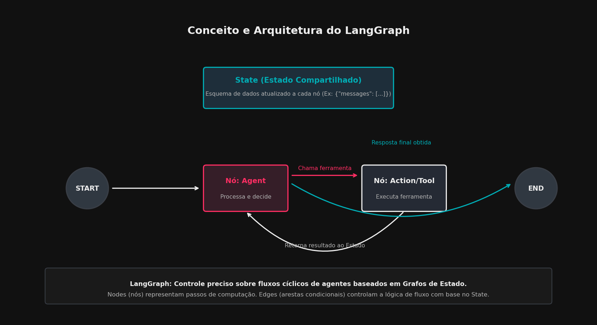

# Executando Inferências com Modelos de IA

Este documento explica as metodologias e ecossistemas utilizados atualmente para rodar modelos de Inteligência Artificial, cobrindo desde execução local e uso de APIs de provedores até a orquestração complexa com frameworks como LangChain e LangGraph.

---

## 1. Abordagens de Execução: Local vs. Cloud

A execução de inferência em LLMs divide-se em duas vertentes principais: execução local e serviços em nuvem (APIs).

### Execução Local
Permite rodar modelos diretamente no hardware do usuário. Suas principais vantagens são a privacidade dos dados, a independência de conexão com a internet e a ausência de custos recorrentes por token gerado.
*   **Ollama:** Uma ferramenta que empacota modelos de linguagem em um ecossistema simples e amigável (semelhante ao Docker), rodando como um serviço local.
*   **Llama.cpp:** O motor de inferência em C/C++ de baixo nível que serve de base para o Ollama e outras ferramentas locais. Projetado para rodar modelos GGUF com altíssima performance tanto em CPUs quanto em GPUs.
*   **PyTorch & Hugging Face (Transformers):** A abordagem tradicional e favorita de pesquisadores. Permite baixar modelos do repositório *Hugging Face Hub* e executá-los em Python, oferecendo controle absoluto sobre os tensores e o pipeline de geração.

### APIs de Provedores Online (SaaS)
Oferecem acesso a modelos gigantescos hospedados em supercomputadores corporativos, cobrados pelo volume de tokens consumidos (input/output).
*   **OpenAI API:** Provedor do GPT-4o e GPT-4o-mini.
*   **Anthropic API:** Provedor da família de modelos Claude (Claude 3.5 Sonnet, Claude 3 Opus).
*   **Google Gemini API:** Provedor dos modelos Gemini 1.5 Pro e Flash através da plataforma Google AI Studio.

---

## 2. Funcionamento do Ollama

O **Ollama** revolucionou a execução local de LLMs ao transformar um processo técnico complexo em comandos de linha simples.

### Programação e Arquitetura Interna
O Ollama é programado principalmente em **Go** (Golang), que gerencia o servidor HTTP local, a API REST, o gerenciamento de arquivos e a orquestração de download de modelos. No entanto, o motor de inferência real que executa os cálculos matemáticos do modelo é o **llama.cpp** (escrito em C/C++ altamente otimizado), integrado ao código em Go.

### Instalação no Computador
*   **macOS e Windows:** Disponível como um instalador executável nativo que adiciona o aplicativo à barra de tarefas e disponibiliza a CLI no terminal.
*   **Linux:** Instalado via script de terminal em uma linha (`curl -fsSL https://ollama.com/install.sh | sh`), que configura o Ollama como um serviço de sistema (`systemd`).

### Servidor Local e Disponibilidade de Modelos
Quando instalado, o Ollama roda um servidor local permanente (daemon) na porta **11434** (`http://localhost:11434`). A CLI e qualquer aplicação externa interagem com o modelo enviando requisições JSON a este servidor.

*   **Formatos e Localização dos Modelos:** Os modelos são baixados de um registro próprio da Ollama e armazenados localmente na máquina (geralmente sob `~/.ollama/models` no Linux/macOS ou `%USERPROFILE%\.ollama\models` no Windows). Eles utilizam o formato **GGUF**, que unifica a arquitetura e os pesos do modelo em um único arquivo binário.

### Distribuição entre CPU e GPU (RAM vs. VRAM)
Uma das maiores vantagens da integração com o `llama.cpp` é o **descarregamento parcial de camadas** (*layer offloading*):
*   Se o modelo quantizado couber inteiramente na memória da GPU (**VRAM**), a inferência rodará 100% nela, oferecendo velocidades altíssimas (ex: 50+ tokens por segundo).
*   Caso o tamanho do modelo exceda a VRAM disponível, o Ollama divide o modelo: ele aloca o máximo de camadas possível na GPU (VRAM) e o restante é processado pelo processador (**CPU**) utilizando a memória **RAM** do sistema.
*   *Exemplo:* Um modelo que exige 16 GB de RAM rodando em um PC com GPU de 8 GB de VRAM terá parte de seus blocos de atenção e pesos computados na VRAM e o restante na RAM do sistema.

### Variedades no Repositório Online
Para cada modelo (como Llama 3 ou Mistral), o criador original publica diferentes tamanhos baseados em parâmetros (ex: 8B, 70B, 405B). O repositório do Ollama hospeda essas variações sob diferentes tags, além de disponibilizar múltiplas opções de **quantização** (como `q4_K_M` para 4 bits, `q8_0` para 8 bits, etc.), permitindo que o usuário escolha o melhor trade-off entre precisão matemática e consumo de memória.

---

## 3. Padrão de API da OpenAI e Integração Multi-Provedor

Devido ao pioneirismo da OpenAI, o formato de sua biblioteca e suas requisições HTTP tornaram-se um padrão da indústria (*de facto standard*). Diversos outros provedores locais (como Ollama, vLLM e LM Studio) e provedores em nuvem (como Together AI, Groq e DeepSeek) adotam o mesmo esquema de API para facilitar a migração de código.

### Uso de Chaves de API
Todas as requisições para provedores em nuvem requerem autenticação por meio de chaves secretas de usuário (*API Keys*). Recomenda-se fortemente expor essas chaves no sistema operacional usando variáveis de ambiente (ex: `OPENAI_API_KEY`, `GEMINI_API_KEY`), evitando expor segredos diretamente no código fonte.

### Exemplos de Conexão em Python

#### 1. Conexão Oficial OpenAI (GPT-4o)
```python
import os
from openai import OpenAI

# Inicializa usando a variável de ambiente OPENAI_API_KEY automaticamente
client = OpenAI()

response = client.chat.completions.create(
    model="gpt-4o-mini",
    messages=[
        {"role": "system", "content": "Você é um assistente acadêmico."},
        {"role": "user", "content": "Explique o que é impedância elétrica de forma curta."}
    ]
)

print(response.choices[0].message.content)
```

#### 2. Conexão Oficial Google Gemini
```python
import os
import google.generativeai as genai

# Configura a API Key obtida no Google AI Studio
genai.configure(api_key=os.environ["GEMINI_API_KEY"])

model = genai.GenerativeModel("gemini-1.5-flash")
response = model.generate_content("Qual a função de um transformador elétrico?")

print(response.text)
```

#### 3. Conexão Oficial Anthropic (Claude)
```python
import os
from anthropic import Anthropic

client = Anthropic(
    api_key=os.environ.get("ANTHROPIC_API_KEY"),
)

message = client.messages.create(
    model="claude-3-5-sonnet-latest",
    max_tokens=1000,
    temperature=0,
    system="Responda como um engenheiro elétrico especialista.",
    messages=[
        {"role": "user", "content": "Quais as causas de fator de potência baixo em indústrias?"}
    ]
)

print(message.content[0].text)
```

---

## 4. O Framework LangChain

O **LangChain** é um framework de orquestração projetado para simplificar a criação de aplicações que utilizam LLMs por meio de composição modular. Ele atua como uma camada de abstração sobre diferentes provedores de IA, permitindo ligar prompts, modelos, analisadores de saída e bancos de dados vetoriais de forma integrada.

Abaixo, a Figura 1 ilustra a estrutura dos componentes do LangChain e a composição de pipelines usando a sintaxe LCEL (*LangChain Expression Language*).


*Figura 1: Arquitetura do Ecossistema LangChain*

### Vantagens do LangChain
*   **Modularidade:** Abstrai classes para modelos de chat, bancos de dados vetoriais, memórias e ferramentas.
*   **Portabilidade:** Permite alterar o modelo de inferência (por exemplo, de um modelo comercial em nuvem para um modelo local no Ollama) alterando apenas a classe do modelo, mantendo o restante da pipeline inalterada.
*   **Sintaxe LCEL (LangChain Expression Language):** Utiliza o operador pipe (`|`) do Python para encadear operações de forma limpa, garantindo suporte nativo a streaming de tokens e chamadas assíncronas.

### Exemplo de Pipeline LangChain + Ollama (Python)
Para executar este exemplo, certifique-se de que o Ollama está rodando localmente com o modelo Llama 3 instalado (`ollama run llama3`).

```python
from langchain_community.llms import Ollama
from langchain_core.prompts import ChatPromptTemplate
from langchain_core.output_parsers import StrOutputParser

# 1. Instancia o modelo local rodando via Ollama
llm = Ollama(model="llama3", base_url="http://localhost:11434")

# 2. Define o template de prompt com variáveis dinâmicas
prompt_template = ChatPromptTemplate.from_messages([
    ("system", "Você é um professor de física. Responda de forma simples e didática em português."),
    ("user", "Explique o conceito de {tema} aplicada à rede elétrica comercial.")
])

# 3. Define o analisador de saída para retornar apenas o texto limpo
output_parser = StrOutputParser()

# 4. Compõe a cadeia (Chain) usando a sintaxe LCEL
chain = prompt_template | llm | output_parser

# 5. Executa a cadeia passando as variáveis
resultado = chain.invoke({"tema": "fase e neutro"})
print(resultado)
```

---

## 5. O Framework LangGraph

Enquanto o LangChain é excelente para pipelines lineares simples (A -> B -> C), ele se torna complexo de gerenciar quando precisamos de fluxos de tomada de decisão não lineares e cíclicos, comuns em comportamentos de agentes autônomos. 

O **LangGraph** foi criado para resolver essa limitação. Ele é uma extensão do ecossistema LangChain voltada para a criação de aplicações multiagentes e fluxos baseados em **máquinas de estados cíclicas**.

Abaixo, a Figura 2 apresenta conceitualmente como funciona o fluxo de estados no LangGraph, ilustrando a transição entre nós (*Nodes*), arestas (*Edges*) e a memória compartilhada (*State*).


*Figura 2: Conceito e Arquitetura do LangGraph*

### Conceitos Fundamentais do LangGraph
*   **State (Estado):** Uma estrutura de dados compartilhada (geralmente um dicionário ou lista de mensagens) acessível por todos os componentes do grafo. Cada etapa do processo pode ler do estado e adicionar ou modificar chaves dele.
*   **Nodes (Nós):** Funções em Python que executam lógica computacional (como chamar um LLM, processar dados ou executar uma ferramenta) e atualizam o *State* com seu resultado.
*   **Edges (Arestas):** Definem a ordem e o fluxo de transição entre os nós. Podem ser simples (nó A sempre vai para o nó B) ou **Arestas Condicionais** (uma função avalia o estado atual e decide se o fluxo vai para o nó B, para a execução de uma ferramenta, ou encerra no nó final).

### Exemplo de Agente de Suporte Cíclico com LangGraph + Ollama
O exemplo abaixo define um fluxo onde o agente analisa uma solicitação de rede elétrica. Se ele decidir que precisa de uma ferramenta de cálculo, ele chama um nó de cálculo e volta ao agente para reavaliar a resposta; caso contrário, ele encerra o fluxo enviando a resposta final ao usuário.

```python
from typing import TypedDict, Annotated, Sequence
import operator
from langchain_core.messages import BaseMessage, HumanMessage, AIMessage
from langchain_community.llms import Ollama
from langgraph.graph import StateGraph, START, END

# 1. Define a estrutura do Estado Compartilhado
class AgentState(TypedDict):
    messages: Annotated[Sequence[BaseMessage], operator.add]

# Inicializa o modelo Ollama
llm = Ollama(model="llama3", base_url="http://localhost:11434")

# 2. Define o Nó do Agente
def call_agent(state: AgentState):
    messages = state['messages']
    # O modelo decide como responder com base nas mensagens acumuladas
    resposta = llm.invoke(f"Responda à seguinte questão como um assistente de suporte técnico elétrico: {messages[-1].content}")
    return {"messages": [AIMessage(content=resposta)]}

# 3. Define a Aresta Condicional de Roteamento
def should_continue(state: AgentState):
    last_message = state['messages'][-1].content.lower()
    # Lógica simples de roteamento simulando tomada de decisão do agente
    if "calcular" in last_message or "calculo" in last_message:
        return "calculator_node"
    return "end"

# 4. Define o Nó da Ferramenta de Cálculo (simulada)
def call_calculator(state: AgentState):
    # Executa uma operação ou cálculo específico e injeta a resposta no fluxo
    calculo_resultado = "Resultado do Cálculo de Potência Ativa: P = V * I * cos(phi) = 220V * 10A * 0.92 = 2024 Watts."
    return {"messages": [AIMessage(content=f"[Ferramenta de Cálculo]: {calculo_resultado}")]}

# 5. Constrói o Grafo de Estados
workflow = StateGraph(AgentState)

# Adiciona os nós ao fluxo
workflow.add_node("agent_node", call_agent)
workflow.add_node("calculator_node", call_calculator)

# Define as conexões (Edges)
workflow.add_edge(START, "agent_node")

# Adiciona a lógica de decisão condicional na saída do nó do Agente
workflow.add_conditional_edges(
    "agent_node",
    should_continue,
    {
        "calculator_node": "calculator_node",
        "end": END
    }
)

# O nó de cálculo retorna a execução de volta para o agente reavaliar ou formatar
workflow.add_edge("calculator_node", "agent_node")

# Compila o grafo para execução
app = workflow.compile()

# 6. Executa o Agente com uma entrada do usuário
solicitacao = HumanMessage(content="Preciso calcular a potência ativa instalada em um circuito residencial monofásico de 220V, corrente medida de 10A e fator de potência de 0.92.")
historico = app.invoke({"messages": [solicitacao]})

# Imprime o histórico completo de interação dos nós
for msg in historico['messages']:
    print(f"{type(msg).__name__}: {msg.content}\n")
```
